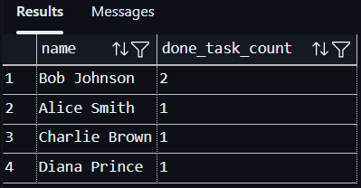

# week-5

## Assignment 2 - Query set

- ### problem-X1

Before executing X1 query run the query below to Seed a deliberate tie at third place

INSERT INTO tasks (title, description, status, priority, project_id, assignee_id, due_date)
VALUES ('Design Contact Page', 'Create Figma', 'done', 1, 1, 4, CURRENT_DATE - INTERVAL '10 days');

Result:

