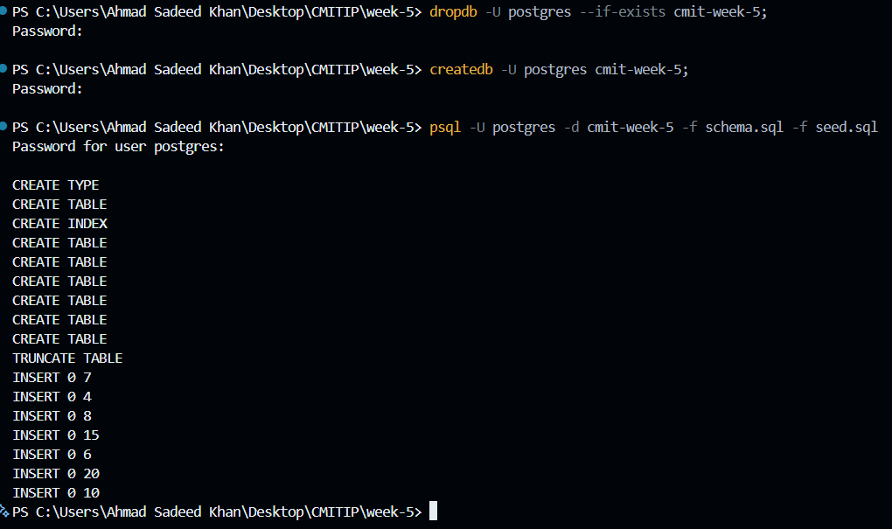
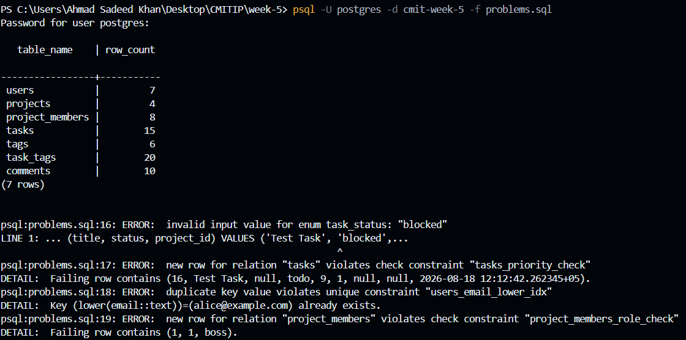
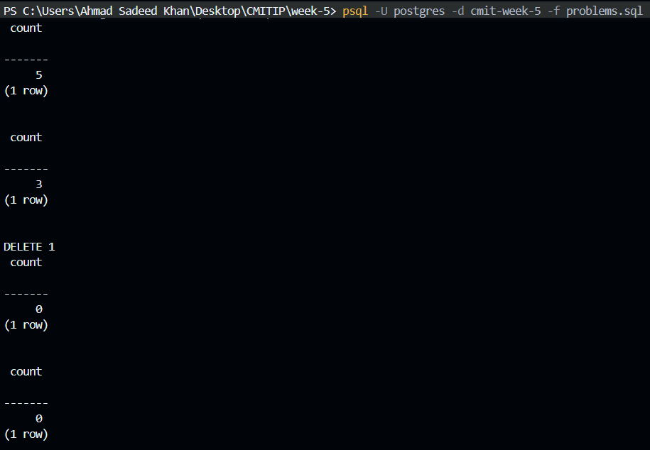

# Week-5

## Assignment 1 - Schema & seed

### Run Commands

1. dropdb -U postgres --if-exists cmit-week-5;
2. createdb -U postgres cmit-week-5;
3. psql -U postgres -d cmit-week-5 -f schema.sql -f seed.sql

### Queries

To run queries: psql -U postgres -d cmit-week-5 -f problems.sql

- Select and Insert Verification

- Delete Cascade

