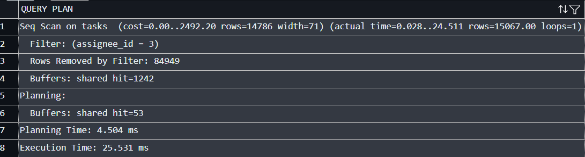
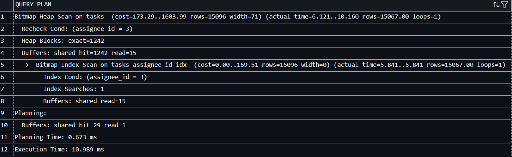
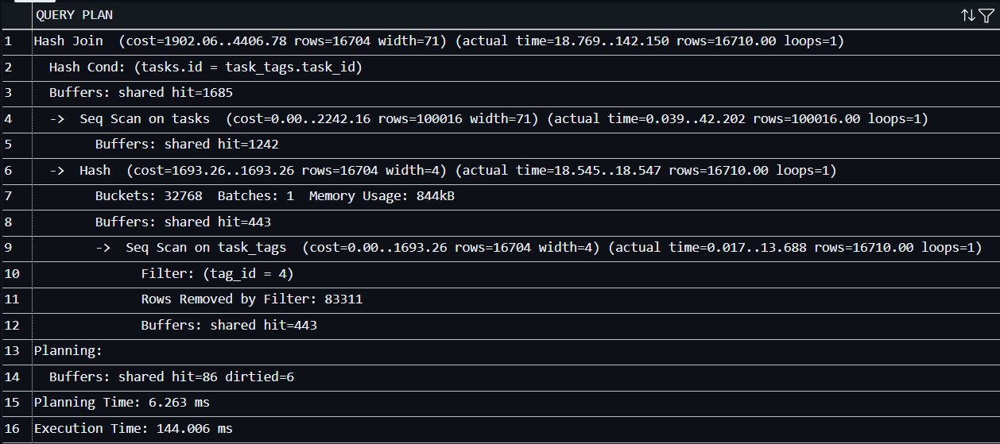
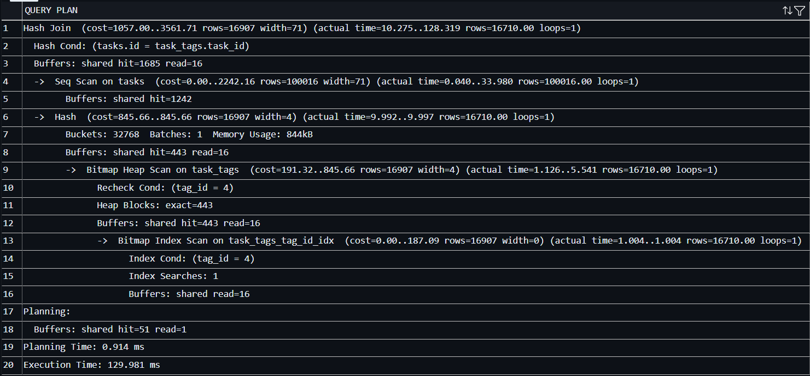

## W1 — Index on tasks(project_id)

Postgres does not automatically index a foreign key column, it only indexes the columns on the referenced side (the primary key). project_id on tasks is a plain column with a FK constraint, so without this index every lookup by project has to scan the whole tasks table.

This serves Q1 ("all tasks for one project"), which filters directly on tasks.project_id = :id. It also helps Q7 ("projects with no tasks"), since its NOT EXISTS subquery filters tasks.project_id = projects.id once per project row.

Note: on the current seed data (15 rows total), EXPLAIN still shows a Seq Scan even with the index in place, the planner correctly judges that scanning 15 rows is cheaper than an index lookup at this size. The index matters once tasks grows large enough that a full scan actually costs more than an index scan; the seed is just too small to demonstrate that difference visually.

## W2 — Index on tasks(assignee_id), tasks(status), task_tags(tag_id)

1. tasks(assignee_id) is the join key in Q3 and Q6. Without it, both queries have to scan every row of tasks to build the join, once per query. It's the second most-used non-PK column in the query set after project_id.
2. tasks(status) Filters directly on this column in Q5 and Q6, and it's the GROUP BY column in Q2. Worth flagging the tradeoff explicitly here: status is a 3-value ENUM, so it's low-cardinality roughly a third of the table matches any single value, which is exactly the case where an index gives the planner the least benefit over a seq scan, since it still ends up reading a large fraction of the table either way. It earns its place for Q5 (<>, i.e. excluding one value out of three, so it's more selective than an equality filter would be) and because Q6 combines it with the assignee_id join.
3. task_tags's primary key is (task_id, tag_id), so it's only efficient for lookups that start with task_id. Q4 ("tasks with a given tag") does the opposite: it finds the tag's id first, then has to search task_tags by tag_id alone. Before this index, EXPLAIN showed Postgres doing a bitmap scan over the entire task_tags_pkey index checking every entry for a tag_id match because tag_id isn't the leading column of that PK, it can't jump straight to matches. This index fixes exactly that case.

### Cost tradeoff

Every index here speeds up a specific read pattern from the query set, but each one also adds write overhead (every INSERT/UPDATE/DELETE on tasks or task_tags now has to maintain one more index) and disk space. That's why each index above is tied to a specific query rather than added speculatively, for example users.name isn't indexed even though it appears in several SELECT lists, because it's never filtered or joined on in any query here.

## C2: proving ROLLBACK is a true no-op

Ran the same reassign-then-remove shape as C1's transaction, but for a different departure (user 2 leaving project 1, tasks reassigned to user 5), ending in ROLLBACK instead of COMMIT.

|                                      | User 5's task count | User 2's project 1 membership |
| ------------------------------------ | ------------------- | ----------------------------- |
| Before transaction                   | 3                   | 1                             |
| During transaction (before ROLLBACK) | 7                   | 0                             |
| After ROLLBACK                       | 3                   | 1                             |

## C3: EXPLAIN ANALYZE

1. Pair 1 — tasks(assignee_id)

Before

After

What changed: the top-level node went from Seq Scan on tasks to Bitmap Heap Scan on tasks (with a Bitmap Index Scan on tasks_assignee_id_idx feeding it). Planner cost dropped from 2492.20 down to 1603.99, and measured execution time dropped from 25.531 ms to 10.989 ms — more than halved. Both direction and magnitude line up with what you'd expect: same Rows Removed by Filter: 84949 situation before (scanning and discarding ~85% of the table), replaced by an index jump straight to the matching ~15k rows after.

2. Pair 2 — task_tags(tag_id)

Before

After

What changed: the task_tags side of the join went from Seq Scan on task_tags (cost 1693.26, actual 13.688 ms for that node alone) to Bitmap Heap Scan + Bitmap Index Scan on task_tags_tag_id_idx (cost 845.66, actual 5.541 ms for that node). That's the node that changed and the reasoning is right. Overall query cost dropped 4406.78 → 3561.71, and total execution time dropped 144.006 ms → 129.981 ms.
